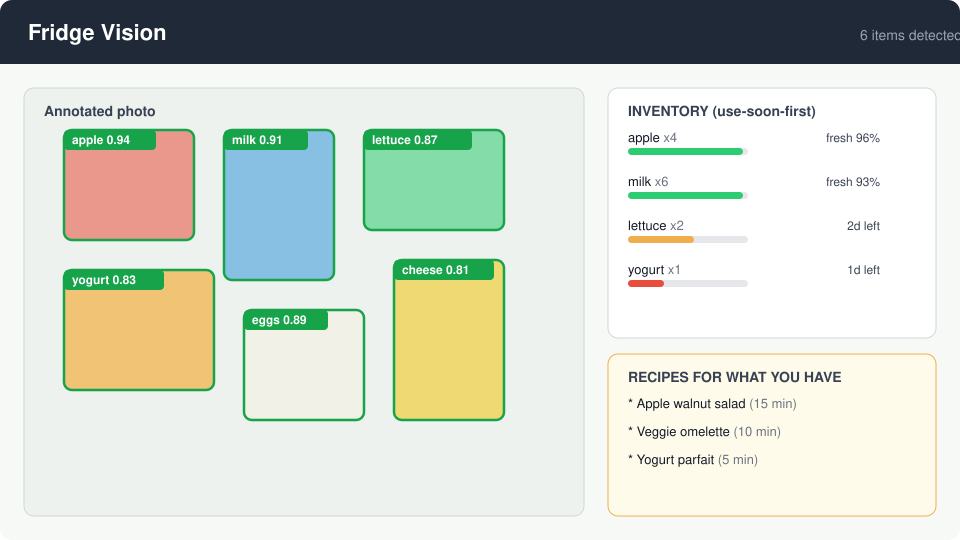

# Fridge Vision

Snap a photo of your fridge. Fridge Vision tells you what is inside, how fresh it is, and what to cook with it.



## What it does

Upload a fridge photo and get:

1. **Item detection** - YOLOv8 (pretrained on COCO) finds fridge-relevant items: fruit, drinks, leftovers, and containers, with bounding boxes and confidence scores.
2. **Freshness scoring** - a logistic regression classifier trained on real fresh-vs-rotten produce photos scores each detected item from handcrafted color (HSV histograms, browning ratio) and texture (local binary patterns) features.
3. **Smart inventory** - a shelf-life table turns freshness into estimated days left, sorted use-soon-first with storage tips.
4. **Recipe recommendations** - TF-IDF retrieval matches your detected items against 39 curated recipes.

## Quickstart

```bash
pip install -r requirements.txt
# CPU-only torch (recommended without a GPU):
# pip install torch --index-url https://download.pytorch.org/whl/cpu

python app.py
# open http://localhost:5000
```

Upload a fridge photo and you will see the annotated image, the inventory table, and recipe suggestions.

No API keys needed. The YOLOv8n weights download automatically on first run (~6 MB).

## Training the freshness model

The freshness classifier is trained on a streamed sample of the
[Project-AgML fresh/rotten fruit dataset](https://huggingface.co/datasets/Project-AgML/fresh_rotten_fruit_classification)
(CC-BY-4.0, fresh vs rotten labels across fruit types). Streaming avoids downloading the full ~900 MB.

```bash
# streams a balanced sample: 150 per fruit x 4 fruits x fresh/rotten
python scripts/download_data.py --per-class 600 --per-fruit 150
python scripts/train_freshness.py                 # trains, evaluates, ships JSON
```

Model: logistic regression on 44 handcrafted features (12-bin hue, 8-bin saturation,
8-bin value histograms, 10-bin LBP texture histogram, browning/dullness/colorfulness stats),
standardized, class-balanced. Trained on a balanced sample of 1,200 produce photos
(150 each of apple, banana, grape, guava x fresh/rotten). Ships as
`models/freshness_model.json` (scaler stats + coefficients), so inference needs
nothing but numpy.

<!-- TRAINING_METRICS -->
Test results (20% held-out split, stratified, n=240):

| Model | Accuracy | F1 |
|---|---|---|
| Logistic regression (shipped) | 0.975 | 0.975 |
| HistGradientBoosting (reference) | 0.996 | 0.996 |

<!-- /TRAINING_METRICS -->

## Project structure

```
fridge-vision/
  app.py                 # Flask demo UI (upload -> annotated results)
  templates/             # index + results pages
  src/
    detect.py            # YOLOv8 fridge item detection + annotation
    features.py          # HSV/LBP feature extraction (numpy/Pillow only)
    freshness.py         # freshness scorer (loads JSON logistic regression)
    inventory.py         # shelf-life table -> days-left estimates
    recipes.py           # TF-IDF recipe recommender
    pipeline.py          # end-to-end: photo -> detections -> report
  scripts/
    download_data.py     # stream fresh/rotten produce sample from Hugging Face
    train_freshness.py   # train + evaluate the freshness classifier
    make_demo.py         # render screenshots/demo.svg
  data/
    recipes.csv          # 39 curated recipes (title, ingredients, time, steps)
    shelf_life.csv       # fridge shelf-life table with storage tips
  models/
    freshness_model.json # trained classifier (JSON, no binary blobs)
  tests/                 # pytest suite
```

## Tech stack

Python, YOLOv8 (Ultralytics), scikit-learn, Flask, Pillow, numpy, matplotlib, pytest.

## Resume bullets

- Built a computer vision app that detects fridge contents with YOLOv8 (19 items in the demo photo) and scores produce freshness with a logistic regression classifier (44 handcrafted color/texture features) trained on 1,200 fresh-vs-rotten produce photos, achieving 97.5% accuracy on a held-out test set.
- Shipped an end-to-end Flask demo: photo upload, annotated detections, use-soon-first inventory with shelf-life estimates, and TF-IDF recipe recommendations from detected ingredients.
- Engineered a JSON-serialized model artifact so inference runs on numpy alone, with a pytest suite covering features, inventory logic, recommendations, and the web UI.

## License

MIT
